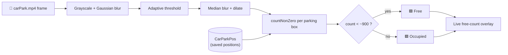

# 🅿️ Car Park Space Counter

<p>
  
  
  
  
</p>

A real-time **parking space counter** built with OpenCV. It processes a car-park video,
classifies each marked space as **free** or **occupied**, and overlays a live count of
available spots — a classic computer-vision pipeline with no machine-learning model required.

---

## 🎥 How It Works

The pipeline turns each video frame into a clean binary image, then counts white pixels
inside every parking rectangle to decide whether a car is present:

1. **Grayscale** → **Gaussian blur** to reduce noise
2. **Adaptive thresholding** (`ADAPTIVE_THRESH_GAUSSIAN_C`) → binary image
3. **Median blur** + **dilation** to remove speckles and strengthen shapes
4. For each parking box, `cv2.countNonZero` counts white pixels
   - fewer than the threshold (≈900) → **empty** (green box)
   - otherwise → **occupied** (red box)
5. The number of free spaces is rendered on the frame with `cvzone`

Parking-space coordinates are defined once with the interactive picker and stored in the
`CarParkPos` file (Python pickle), so `main.py` reuses them on every run.

### Pipeline



---

## 📁 Project Structure

```text
CarParkProject/
├── main.py                 # Runs detection on the video, shows live free-space count
├── ParkingSpacePicker.py   # Interactive tool to mark/remove parking spaces
├── CarParkPos              # Saved parking-space coordinates (pickle)
├── carPark.mp4             # Source car-park video
└── carParkImg.png          # Reference frame used by the space picker
```

---

## 🚀 Setup

```bash
git clone https://github.com/yagmurtncr/Car-Park-Project.git
cd Car-Park-Project/CarParkProject
pip install -r ../requirements.txt
```

> The scripts load `carPark.mp4`, `carParkImg.png` and `CarParkPos` by relative path,
> so run them from inside the `CarParkProject/` folder.

---

## 💻 Usage

**1. (Optional) Mark parking spaces**

```bash
python ParkingSpacePicker.py
```

- **Left-click** on the reference image to add a parking rectangle
- **Right-click** inside a rectangle to remove it
- Positions are saved automatically to `CarParkPos`

**2. Run the live counter**

```bash
python main.py
```

A window shows the video with green (free) / red (occupied) boxes and the total number of
free spaces. The video loops automatically.

---

## 🛠️ Tech Stack

- **Python**, **OpenCV** (`opencv-python`) — video I/O and image processing
- **cvzone** — convenient text/box overlays
- **NumPy** — dilation kernel and array ops

---

## 📄 License

Released under the [MIT License](LICENSE).
